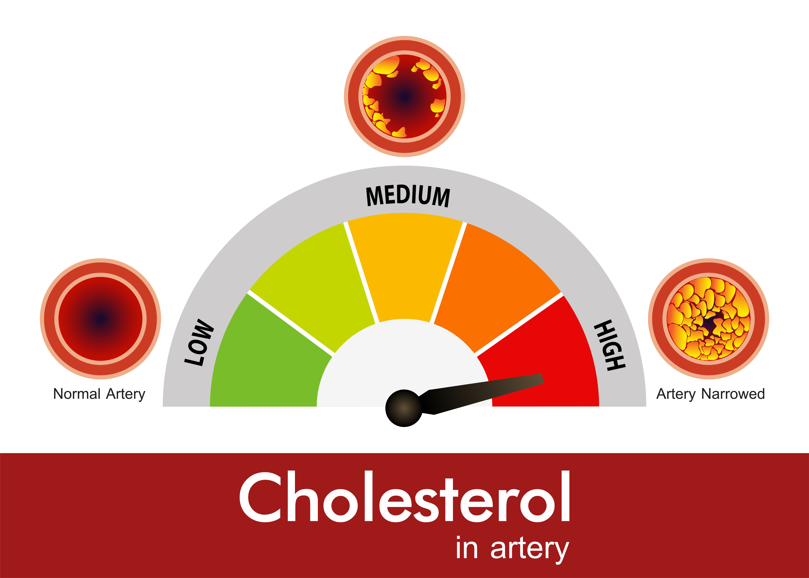

### **Adverse Effects of High Cholesterol**

Nearly 40% of adults in the United States grapple with high cholesterol levels, defined as total blood cholesterol equal to or exceeding 200 mg/dL. This elevated cholesterol poses a significant risk for heart disease and stroke, both prominent contributors to mortality in the United States. (CDC, 2023)

{width=60%}

### **National Prevalence**

Upon data analysis, we condensed the cholesterol risk across different locations in the United States from the **PLACES: Local Data for Better Health** dataset ([sources, part 1](source.html)), identifying key behavioral factors predominantly associated with the risk through correlation analysis.

Read [Prevalence EDA](eda.html) here.

### **Cholesterol-Associated Factors**

After utilizing **NHANCES** dataset ([sources, part 2](source.html)), we made a in-depth [Exploratory Analysis](Exploratory-Analysis.html), and at last we pinpointed the primary influencers of cholesterol and constructed the final [Build Model](model.html) for predicting individual cholesterol levels.

{width=60%}

### **Check Your Cholesterol Level!**

Just enter some simple information to get your current cholesterol levels.

Click ["Predict Your Risk"](https://ruiqixue.shinyapps.io/shiny/) to take the test!

### **Report**

Explore our [Report](report.html) to discover the pivotal insights derived from our analysis!

### **Lovely Creators**

* Shihui Peng (sp4170)
* Jingyu Wang (jw4348)
* Yuxuan Wang (yw3995)
* Ruiqi Xue (rx2236)
* Jiangyuan Zhu (jz3573)

Click [here](About-Us.html) to learn more about us.

The link to the repository of this project can be found [here](https://github.com/Pengshihui99/cholesterol.github.io).
