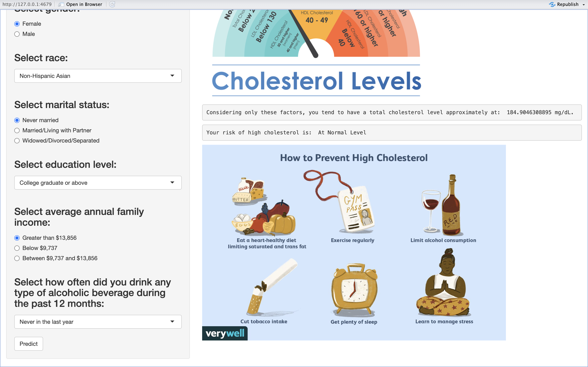

```{r setup, include=FALSE}
library(tidyverse)
library(haven)
library(sf)
knitr::opts_chunk$set(
  warning = FALSE, 
  message = FALSE,
  fig.align = 'center')


theme_set(theme_minimal() + theme(legend.position = "bottom"))
```

# **Motivation**
Our project aims to explore the intricate relationship between health affecting behaviors and the health outcome of High cholesterol levels. With the growing concern about cardiovascular diseases and their association with lifestyle choices, understanding these relationships is crucial. We intend to use comprehensive datasets to analyze and model these associations, providing insights that could lead to better health outcomes.

# **Related Work**
Our inspiration stems from an introductory article by the American Heart Association (2020) titled "What is Cholesterol?" This article shed light on the profound impact of cholesterol on the human body. Recognizing that daily eating habits and behaviors can contribute to elevated cholesterol levels and pose a risk to cardiovascular health, we aim to develop a website. This platform aims to empower individuals by providing insights into their cholesterol levels, educating them about the associated risks, and encouraging proactive steps to maintain or enhance their overall health.

# **Initial Questions**
The purposes of this project is to answer the following questions:

- What kind and extent of the correlations between our targeted health outcome - high cholesterol and health related behaviors at national level?
- What patterns do their correlation exhibit in the graphs?
- By using the individual dataset, which models are effective in capturing the association between high cholesterol and a set of health-related behaviors identified in national dataset that exhibit a strong correlation?
- How can we create a user-friendly tool enabling individuals to evaluate their personal risk of high cholesterol using demographic features and lifestyle choices?


# **Data Sources and Cleaning**
## *Part 1: [PLACES: Local Data for Better Health](https://data.cdc.gov/500-Cities-Places/PLACES-Local-Data-for-Better-Health-County-Data-20/swc5-untb/about_data)*

We acquire county level health prevalence data of the entire United States during the time period from 2020 to 2021. The data were provided by the CDC, Division of Population Health, Epidemiology and Surveillance Branch.It has 229K rows and 21 columns initially. The estimates encompass 36 measures, spanning health outcomes, preventive services use, chronic disease-related health risk behaviors, disabilities, and health status. We are using several health-affecting behavior variables and the prevalence of High Cholesterol to evaluate and sorting out the most correlated risk factors to the outcome at the national level.


```{r, message=FALSE, warning=FALSE}


library(tidyverse)
library(purrr)
library(dplyr)
library(plotly)
library(tools)

prevalence_df = read_csv("data/PLACES__Local_Data_for_Better_Health__County_Data_2023_release.csv") |>
  janitor::clean_names() |>
  select(year, state_abbr, category, measure, data_value, total_population, category_id, measure_id, short_question_text) |>
  filter(year == 2021)

prevalence_outcome = prevalence_df |>
  filter(category == "Health Outcomes")
  
prevalence_chol = prevalence_outcome |>
  filter(measure_id == "HIGHCHOL") |>
  select(state_abbr, data_value, total_population) |>
  mutate(dis_popu = as.integer(total_population * data_value * 0.01)) |>
  group_by(state_abbr) |>
  summarise(state_abbr, total_popu = sum(total_population), disease_popu = sum(dis_popu)) |>
  distinct() |>
  mutate(chol_pre_2021 = disease_popu / total_popu) |>
  select(-disease_popu)
  
  
prevalence_risk = prevalence_df |>
  filter(category == "Health Risk Behaviors")
  

risk_lpa = prevalence_risk |>
  filter(measure_id == "LPA") |>
  select(state_abbr, data_value, total_population) |>
  mutate(dis_popu = as.integer(total_population * data_value * 0.01)) |>
  group_by(state_abbr) |>
  summarise(state_abbr, total_popu = sum(total_population), disease_popu = sum(dis_popu)) |>
  distinct() |>
  mutate(lpa_pre = disease_popu / total_popu) |>
  select(-disease_popu)


risk_binge = prevalence_risk |>
  filter(measure_id == "BINGE") |>
  select(state_abbr, data_value, total_population) |>
  mutate(dis_popu = as.integer(total_population * data_value * 0.01)) |>
  group_by(state_abbr) |>
  summarise(state_abbr, total_popu = sum(total_population), disease_popu = sum(dis_popu)) |>
  distinct() |>
  mutate(binge_pre = disease_popu / total_popu) |>
  select(-disease_popu)


risk_smoking = prevalence_risk |>
  filter(measure_id == "CSMOKING") |>
  select(state_abbr, data_value, total_population) |>
  mutate(dis_popu = as.integer(total_population * data_value * 0.01)) |>
  group_by(state_abbr) |>
  summarise(state_abbr, total_popu = sum(total_population), disease_popu = sum(dis_popu)) |>
  distinct() |>
  mutate(smoking_pre = disease_popu / total_popu) |>
  select(-disease_popu)


prevalence_prevention = prevalence_df |>
  filter(category == "Prevention")

prevention_insurance = prevalence_prevention |>
  filter(measure_id == "ACCESS2") |>
  select(state_abbr, data_value, total_population) |>
  mutate(dis_popu = as.integer(total_population * data_value * 0.01)) |>
  group_by(state_abbr) |>
  summarise(state_abbr, total_popu = sum(total_population), disease_popu = sum(dis_popu)) |>
  distinct() |>
  mutate(insurance_pre = disease_popu / total_popu) |>
  select(-disease_popu)

prevention_cholscreen = prevalence_prevention |>
  filter(measure_id == "CHOLSCREEN") |>
  select(state_abbr, data_value, total_population) |>
  mutate(dis_popu = as.integer(total_population * data_value * 0.01)) |>
  group_by(state_abbr) |>
  summarise(state_abbr, total_popu = sum(total_population), disease_popu = sum(dis_popu)) |>
  distinct() |>
  mutate(cholscreen_pre = disease_popu / total_popu) |>
  select(-disease_popu)


prevalence_df_2020 = read_csv("data/PLACES__Local_Data_for_Better_Health__County_Data_2023_release.csv") |>
  janitor::clean_names() |>
  select(year, state_abbr, category, measure, data_value, total_population, category_id, measure_id, short_question_text) |>
  filter(year == 2020)

risk_sleep_2020 = prevalence_df_2020 |>
  filter(category == "Health Risk Behaviors") |>
  filter(measure_id == "SLEEP") |>
  select(state_abbr, data_value, total_population) |>
  mutate(dis_popu = as.integer(total_population * data_value * 0.01)) |>
  group_by(state_abbr) |>
  summarise(state_abbr, total_popu = sum(total_population), disease_popu = sum(dis_popu)) |>
  distinct() |>
  mutate(sleep_pre = disease_popu / total_popu) |>
  select(-disease_popu)


prevalence_chol_2020 = prevalence_df |>
  filter(category == "Health Outcomes") |>
  filter(measure_id == "HIGHCHOL") |>
  select(state_abbr, data_value, total_population) |>
  mutate(dis_popu = as.integer(total_population * data_value * 0.01)) |>
  group_by(state_abbr) |>
  summarise(state_abbr, total_popu = sum(total_population), disease_popu = sum(dis_popu)) |>
  distinct() |>
  mutate(chol_pre_2020 = disease_popu / total_popu) |>
  select(-disease_popu)

merged_2021 = Reduce(function(df1, df2) left_join(df1, df2, by = c("state_abbr", "total_popu")), list(prevalence_chol, risk_binge, risk_lpa, risk_smoking, prevention_insurance, prevention_cholscreen))

merged_2020 = left_join(prevalence_chol_2020, risk_sleep_2020)
merged_total = left_join(merged_2021, merged_2020)

merged_total |> 
  knitr::kable(digits = 3) |>
  kableExtra::kable_styling(bootstrap_options = c("striped", "hover"), font_size = 12) |> 
  kableExtra::scroll_box(width = "100%", height = "300px")
```

Above is the final dataframe `merged_total`, with 51 rows (states) and 9 columns. This will be used as the main dataframe in the following steps of exploratory analysis. 

Firstly, we filter six health-related variables, including `binge drinking`, `currently smoking`, `no leisure-time physical activity (physical activity)`, `lacking health insurance`, `cholesterol screening`, and `sleep less than 7 hours (lacking sleep)`, and pivot longer for easier reading and better visualization. We calculate state level prevalence by organizing and calculation county-level data.

Next, we join the map dataset obtained from [this website](https://www.census.gov/geographies/mapping-files/time-series/geo/carto-boundary-file.html) of the U.S.Census Bureau with the cleaned prevalence dataframe by `state abbreviation`. we link geographic prevalence data into the USA’s map to show the distribution of cholesterol prevalence across the nation. 

It is worth nothing that when mapping, we exclude HI and AK for better visualization, as including them will lead to a skewing view of map. FL data is missing in the prevalence data. But we include them into all of our other data analysis process.

Then, we show the prevalence of high cholesterol and these six health related behavior using boxplot, and then show the trend of these six health related behavior across different cholesterol prevalence. After observing obvious trends separately, we calculate the correlation between high cholesterol and each of these health-related behavior, and then display the results in the format of table and two-direction bar chat for better visualization and understanding.


## *Part 2: [NHANCES](https://wwwn.cdc.gov/nchs/nhanes/continuousnhanes/default.aspx?Cycle=2017-2020)*
In order to get individual data measurements to analyze the association of risk factors and `high Cholesterol`, we use the several sub-datasets from `NHANCES` to gather all the variables we are interested from the result of part 1. This resource conducted by the CDC for the time period of 2017 to March 2020 Pre-pandemic. It combines interviews and physical examinations to collect a wide range of health-related information. Initially, all the variables were non-descriptive, we assigned descriptive names for them. While importing the data measurements, the types of all the variables were numberical. Except continuous variables, we categorizd variables `gender`, `race`, `marital_status`, `education_level`, `poverty_level`, and `alcohol_use_cat`. The numbers from drinking habit dataset are not order in a logic way, therefore we reordered variables as `alcohol_use_order`. The dataset with information of physical activity used the skip methods 
The comprehensive dataset employed for our analysis includes detail information for each participant, including key variables such as:

  - `id`: Participants' unique identification numbers
  - `total_cholesterol`: Serum total cholesterol level, in mg/dL
  - `age`: participants' Age at screening , in year
  - `gender`: 2 types: Male or Female
  - `race`: 5 types: Hispanic, Non-Hispanic White, Non-Hispanic Black, Non-Hispanic Asian, Other Race
  - `marital_status`: For the adults 20+ years old, 3 typess: Married/Living with Partner, Widowed/Divorced/Separated, Never married
  - `education_level`: For the adults 20+ years old, 4 levels: Less than 9th grade, 9-11th grade, High school graduate/GED or equivalent, Some college or AA degree, College graduate or above
  - `bmi`: Body Mass Index, in kg/m**2
  - `poverty_level`: Family monthly poverty level category, 3 levels: Below 130% of Poverty Guidelines, Between 130% and 185% of Poverty Guidelines, Above 185% of Poverty Guidelines
  - `physical_activity`: Types of weekly physical activity, 3 levels: Vigorous activity, Moderate activity, Light/Unknown activity
  - `sleep_hour`: The sleeping habits in Weekdays or workdays, in hour
  - `alcohol_use_order`: Ordinal variables, scale from 1 - 11 meaning from never to everyday consuming the alcohol in the past twelve months
  - `alcohol_use_cat`: Category of drinking patterns, 3 levels: Light Drinker, Moderate Drinker, Heavy Drinker
  - `cotinine`: Serum Cotinine concentration, in ng/mL

```{r}
tchol_df = 
  data <- read_xpt("data/xpt/P_TCHOL.XPT") |> 
  janitor::clean_names() |>
  select(id = seqn, total_cholesterol = lbxtc) |> 
  drop_na()

demo1_df = 
  data <- read_xpt("data/xpt/P_DEMO.XPT") |> 
  janitor::clean_names() |> 
  select(id = seqn, age = ridageyr, gender = riagendr, race = ridreth3, 
         marital_status = dmdmartz, education_level_20 = dmdeduc2) |> #only include the variables of id, age, gender, race, marital status, and education level.
  filter(age >= 18) |> # Only include the participants with age equal and greater than 18.
  mutate(
    gender = case_when(
      gender == 1 ~ "Male",
      gender == 2 ~ "Female",
      TRUE ~ as.character(gender)), #categorize variable gender.
    race = case_when(
      race %in% c(1, 2) ~ "Hispanic",
      race == 3 ~ "Non-Hispanic White",
      race == 4 ~ "Non-Hispanic Black",
      race == 6 ~ "Non-Hispanic Asian",
      race == 7 ~ "Other Race",
      TRUE ~ as.character(race)), #categorize variable race.
    marital_status = case_when(
      marital_status %in% c(77, 99, ".") ~ NA_character_,
      marital_status == 1 ~ "Married/Living with Partner",
      marital_status == 2 ~ "Widowed/Divorced/Separated",
      marital_status == 3 ~ "Never married",
      TRUE ~ as.character(marital_status)), #categorize variable marital status.
    education_level_20 = case_when(
      education_level_20 %in% c(7, 9, ".") ~ NA_character_,
      education_level_20 == 1 ~ "Less than 9th grade",
      education_level_20 == 2 ~ "9-11th grade",
      education_level_20 == 3 ~ "High school graduate/GED or equivalent",
      education_level_20 == 4 ~ "Some college or AA degree",
      education_level_20 == 5 ~ "College graduate or above",
      TRUE ~ as.character(education_level_20)) #categorize education level status.
   )

bmi_df = 
  data <- read_xpt("data/xpt/P_BMX.XPT") |> 
  janitor::clean_names() |>
  select(id = seqn, bmi = bmxbmi) |> 
  drop_na()

income_df = 
  read_xpt("data/xpt/P_INQ.XPT") |> 
  janitor::clean_names() |>
  select(id = seqn, poverty_level = indfmmpi) |> 
  drop_na() |> 
  mutate(
    poverty_level = case_when(
      poverty_level < 1.3 ~ "Below 130% of Poverty Guidelines",
      between(poverty_level, 1.3, 1.85) ~ "Between 130% and 185% of Poverty Guidelines",
      poverty_level > 1.85 ~ "Above 185% of Poverty Guidelines",
      TRUE ~ as.character(poverty_level))
        )

demo_df <- demo1_df |> 
  left_join(income_df, by = "id") |> 
  left_join(bmi_df, by = "id") |> 
  drop_na(age, gender, race, bmi) 

activity_df = 
  data <- read_xpt("data/xpt/P_PAQ.XPT") |> 
  janitor::clean_names() |>
  select(id = seqn, paq605, paq650, paq620, paq635, paq665) |> 
  drop_na() |> 
  mutate(
    physical_activity = case_when(
      paq605 == 1 | paq650 == 1 ~ "Vigorous activity",
      paq620 == 1 | paq635 == 1 | paq665 == 1 ~ "Moderate activity",
      paq665 == 2 ~ "Light/Unknown activity",
      TRUE ~ NA_character_ )
        ) |> 
  select(id, physical_activity)

sleep_df = 
  data <- read_xpt("data/xpt/P_SLQ.XPT") |> 
  janitor::clean_names() |>
  select(id = seqn, sleep_hour = sld012) |> 
  drop_na()

alcohol_df = 
  data <- read_xpt("data/xpt/P_ALQ.XPT") |> 
  janitor::clean_names() |>
  mutate(
    alcohol_use_cat = case_when(
      alq121 %in% c(0, 10, 9, 8) ~ "Light Drinker",
      alq121 %in% c(7, 6, 5, 4) ~ "Moderate Drinker",
      alq121 %in% c(3, 2, 1) ~ "Heavy Drinker",
      alq121 %in% c(77, 99, ".") ~ NA_character_),
     alcohol_use_order = case_when(
      alq121 == 0 ~ 1,
      alq121 == 10 ~ 2,
      alq121 == 9 ~ 3,
      alq121 == 8 ~ 4,
      alq121 == 7 ~ 5,
      alq121 == 6 ~ 6,
      alq121 == 5 ~ 7,
      alq121 == 4 ~ 8,
      alq121 == 3 ~ 9,
      alq121 == 2 ~ 10,
      alq121 == 1 ~ 11)
        ) |> 
   select(id = seqn, alcohol_use_cat, alcohol_use_order) |> 
   drop_na()

smoking_df = 
  data <- read_xpt("data/xpt/P_COT.XPT") |> 
  janitor::clean_names() |>
  select(id = seqn, cotinine = lbxcot) |> 
  drop_na()

combine_df = 
  tchol_df |> 
  left_join(demo_df, by = "id") |>
  left_join(activity_df, by = "id") |>
  left_join(sleep_df, by = "id") |>
  left_join(alcohol_df, by = "id") |>
  left_join(smoking_df, by = "id") |> 
  drop_na(age, gender, race)

write.csv(combine_df, file = "data/combine.csv")

combine_df %>% 
  knitr::kable(digits = 3) %>% 
  kableExtra::kable_styling(bootstrap_options = c("striped", "hover"), font_size = 12) %>% 
  kableExtra::scroll_box(width = "100%", height = "300px")
```
<dr>

Above is the final dataset `combine_df`, with 8161 observations and 14 variables will be used in following steps of exploratory and statistical analysis. 


# **Exploratory Analysis** 

## *Part 1: National-level Prevalence Analysis*

### Prevalence Visulization

* We first visualize the prevalence of HC and health behaviors.


#### The U.S. High Cholesterol Map 
This is to have an overview of the prevalence of high cholesterol among the nation.
```{r, message=FALSE, warning=FALSE}

library(scales)

library(sf)

states = read_sf("data/cb_2022_us_state_500k/") |>
  rename("state_abbr" = "STUSPS")

chol_small_df = merged_total |>
  select(state_abbr, chol_pre_2021)

state_to_remove = c("GU", "MP", "VI", "PR", "AS", "AK", "HI")

geo_df = left_join(states, chol_small_df) |>
  rename("STUSPS" = "state_abbr") |>
  filter(! STUSPS %in% state_to_remove) 

map_plot = ggplot(geo_df) +
  geom_sf(aes(fill = chol_pre_2021, text = paste("State: ", NAME, "<br>Prevalence: ", percent(round(chol_pre_2021, digits = 3))))) +
  scale_fill_distiller("Prevalence", palette="YlOrRd") +
  theme_minimal() +
  theme(axis.ticks = element_blank(), axis.text = element_blank()) +
  labs(title = "Prevalence of High Cholesterol by State")

state_map = ggplotly(map_plot, tooltip = "text") 

 
state_map


```

* Based on the map, we can find that the prevalences of high cholesterol varied among the nation, but were generally higher in the south than in the north of the USA.

#### Health Behaviors Prevalence Boxplot

Draw a boxplot to visualize the prevalence of each health behavior that is related to and has potential association with high cholesterol.

```{r, message=FALSE, warning=FALSE}
chol_pivot = merged_total |>
  select(state_abbr, chol_pre_2020, chol_pre_2021) |>
  pivot_longer(chol_pre_2020 : chol_pre_2021,
               names_to = "chol_year",
               values_to = "prevalence") |>
  mutate(chol_year = case_match(chol_year,
                                "chol_pre_2020" ~ "High Cholesterol 2020",
                                "chol_pre_2021" ~ "High Cholesterol 2021"
                                  ))


behavior_pivot  = merged_total |>
  select(-total_popu, -chol_pre_2021, -chol_pre_2020) |>
  pivot_longer(binge_pre : sleep_pre,
               names_to = "behavior",
               values_to = "prevalence") |>
  mutate(behavior = case_match(behavior,
                               "lpa_pre" ~ "No Leisure-time Physical Activity",
                               "sleep_pre" ~ "Sleep Less Than 7 Hours",
                               "smoking_pre" ~ "Smoking Currently",
                               "insurance_pre" ~ "Lack of Health Insurance",
                               "cholscreen_pre" ~ "Cholesterol Screening",
                               "binge_pre" ~ "Binge Drinking"
                               ),
         behavior = factor(behavior, levels = behavior))
  

y_range_box = range(pull(chol_pivot, prevalence), pull(behavior_pivot, prevalence))

plot1 = chol_pivot |>
  plot_ly(y = ~prevalence, color = ~chol_year, type = "box", colors = c("#F5761A", "#b73779")) |>
  layout(
         xaxis = list(title = 'Year', tickangle=-45),
         yaxis = list(range = y_range_box + c(-0.01, 0.01))
         )
#legend = list(title = list(text = "Chol Year"
plot2 = behavior_pivot |>
  plot_ly(y = ~prevalence, color = ~behavior, type = "box", colors = "viridis") |>
  layout(title = 'High Cholesterol & Behaviors Prevalence',
         xaxis = list(tickangle=-45),
         yaxis = list(range = y_range_box + c(-0.01, 0.01)))


box_plot = subplot(plot1, plot2)

box_plot
```

* Based on the boxplot, we can find that prevalence of high cholesterol was similar between 2020 and 2021. Lacking sleep was the most appreciable health-adverse behavior, followed by lacking physical activities. Binge drinking and smoking problem also existed, while they were not significant compared to other health-adverse behavior. The prevalence of cholesterol screening is high, while the prevalence of lacking health insurance is low. These indicate health-promote behavior.

### Find Top Behaviors
* We try to find the top factors that affect high cholesterol most in terms of correlation

#### Association Trend Plot 

This is to observe trends of associations between prevalence of high cholesterol and prevalence of related health-affecting behaviors.

```{r warning=FALSE, warning=FALSE}

x_range = range(c(pull(merged_total, chol_pre_2021), pull(merged_total, chol_pre_2020)))

y_range = range(c(pull(merged_total, binge_pre), pull(merged_total, lpa_pre), pull(merged_total, smoking_pre), pull(merged_total, insurance_pre), pull(merged_total, cholscreen_pre), pull(merged_total, sleep_pre)))

prevalence_plot = 
merged_total |>
  plot_ly() |>
  add_trace(x = ~chol_pre_2021, y = ~binge_pre, type = 'scatter', size = ~total_popu, sizes = c(50, 250), mode = 'markers', opacity = 0.75, name = 'Binge Drinking', showlegend = TRUE, visible = TRUE) |>
  add_trace(x = ~chol_pre_2021, y = ~lpa_pre, type = 'scatter', mode = 'markers', size = ~total_popu, sizes = c(50, 250), name = 'No Leisure-time Physical Activity', showlegend = TRUE, visible = TRUE) |>
  add_trace(x = ~chol_pre_2021, y = ~smoking_pre, type = 'scatter', mode = 'markers', size = ~total_popu, sizes = c(50, 250), name = 'Smoking Currently', showlegend = TRUE, visible = TRUE) |>
  add_trace(x = ~chol_pre_2021, y = ~insurance_pre, type = 'scatter', mode = 'markers', size = ~total_popu, sizes = c(50, 250), name = 'Lack of Health Insurance Currently', showlegend = TRUE, visible = TRUE) |>
  add_trace(x = ~chol_pre_2021, y = ~cholscreen_pre, type = 'scatter', mode = 'markers', size = ~total_popu, sizes = c(50, 250), name = 'Cholesterol Screening', showlegend = TRUE, visible = TRUE) |>
  add_trace(x = ~chol_pre_2021, y = ~sleep_pre, type = 'scatter', mode = 'markers', size = ~total_popu, sizes = c(50, 250), name = 'Sleep Less Than 7 Hours', showlegend = TRUE, visible = TRUE) |>
  
  layout(title = list(text = 'Prevalence of High Cholesterol v.s. Health-Affecting Behaviors', x = 0.08),
         titlefont = list(size = 15),
         xaxis = list(title = 'Prevalence of High Cholesterol',  tickformat = '.0%', showline = TRUE, range = x_range + c(-0.01, 0.01)),
         yaxis = list(title = 'Prevalence of Health-Affecting Behavior', range = y_range + c(-0.05, 0.05), tickformat = '.0%', showline = TRUE))
         

prevalence_plot

```

* Based on the trend, when the prevalence of high cholesterol increased, we can find the prevalence of smoking, lacking physical activity, lacking sleep, lacking health insurance, and cholesterol screening also increased. The trend of the prevalence of binge drinking is not obvious. Therefore, we move to check sub-association trending plot.

#### Sub-Association Trending Plot

To have a clearer view of each behavior, let's "zoom in" and observe the trending in more detail.

```{r, message=FALSE, warning=FALSE}
fig1 = merged_total |>
  plot_ly() |>
  add_trace(x = ~chol_pre_2021, y = ~binge_pre, type = 'scatter', size = ~total_popu, sizes = c(25, 125), mode = 'markers', opacity = 0.75, name = 'Binge Drinking', showlegend = TRUE, visible = TRUE) |> layout(xaxis = list(tickformat = '.0%'), yaxis = list(tickformat = '.0%'))

fig2 = merged_total |>
  plot_ly() |>
  add_trace(x = ~chol_pre_2021, y = ~lpa_pre, type = 'scatter', mode = 'markers', size = ~total_popu, sizes = c(25, 125), name = 'No Leisure-time Physical Activity', showlegend = TRUE, visible = TRUE) |> layout(xaxis = list(tickformat = '.0%'), yaxis = list(tickformat = '.0%')) 


fig3 = merged_total |>
  plot_ly() |>
  add_trace(x = ~chol_pre_2021, y = ~smoking_pre, type = 'scatter', mode = 'markers', size = ~total_popu, sizes = c(25, 125), name = 'Smoking Currently', showlegend = TRUE, visible = TRUE) |>
layout(xaxis = list(tickformat = '.0%'), yaxis = list(tickformat = '.0%')) 

fig4 = merged_total |>
  plot_ly() |>
  add_trace(x = ~chol_pre_2021, y = ~insurance_pre, type = 'scatter', mode = 'markers', size = ~total_popu, sizes = c(25, 125), name = 'Lack of Health Insurance Currently', showlegend = TRUE, visible = TRUE) |> layout(xaxis = list(tickformat = '.0%'), yaxis = list(tickformat = '.0%'))

fig5 = merged_total |>
  plot_ly() |>
  add_trace(x = ~chol_pre_2021, y = ~cholscreen_pre, type = 'scatter', mode = 'markers', size = ~total_popu, sizes = c(25, 125), name = 'Cholesterol Screening', showlegend = TRUE, visible = TRUE) |> layout(xaxis = list(tickformat = '.0%'), yaxis = list(tickformat = '.0%'))

fig6 = merged_total |>
  plot_ly() |>
  add_trace(x = ~chol_pre_2021, y = ~sleep_pre, type = 'scatter', mode = 'markers', size = ~total_popu, sizes = c(25, 125), name = 'Sleep Less Than 7 Hours', showlegend = TRUE, visible = TRUE) |>
  layout(xaxis = list(tickformat = '.0%'), yaxis = list(tickformat = '.0%'))

pre_sub_figs = subplot(fig1, fig2, fig3, fig4, fig5, fig6, nrows = 2) |>
  layout(title = list(text = 'Prevalence of High Cholesterol v.s. Health-Affecting Behaviors', x = 0.08), titlefont = list(size = 15))

pre_sub_figs
  
```

* Based on these trending plots, we can find the prevalence of high cholesterol was (1) positively associated with the prevalence of smoking, lacking physical activity, lacking sleep, lacking health insurance, and cholesterol screening; and (2) negatively associated with the prevalence of binge drinking.


#### Calculate the correlation between each behavior and high cholesterol

```{r, message=FALSE, warning=FALSE}

cor_table = data.frame(behavior = character(), correlation = numeric(), stringsAsFactors = FALSE)

behavs = colnames(merged_2021[4:8])

for (each in behavs) {
  new_row = data.frame(behavior = substr(each, 1, nchar(each) - 4), correlation = round(cor(pull(merged_2021, chol_pre_2021), pull(merged_2021, each)), digits = 4))
  
  cor_table = rbind(cor_table, new_row)
}

sleep_row = data.frame(behavior = 'sleep', correlation = round(cor(pull(merged_2020, chol_pre_2020), pull(merged_2020, sleep_pre)), digits = 4))

cor_table = rbind(cor_table, sleep_row)
cor_table = arrange(cor_table, desc(abs(correlation)))

cor_table = cor_table |>
  mutate(behavior = case_match(behavior,
                               "lpa" ~ "No Leisure-time Physical Activity",
                               "sleep" ~ "Sleep Less Than 7 Hours",
                               "smoking" ~ "Smoking Currently",
                               "insurance" ~ "Lack of Health Insurance Currently",
                               "cholscreen" ~ "Cholesterol Screening",
                               "binge" ~ "Binge Drinking"
                               ),
         behavior = factor(behavior, levels = behavior)) |>
  rename("Behavior" = behavior,
         "Correlation" = correlation) 


knitr::kable(cor_table)

```


#### Correlation Bar Chart

Use a bar chart to visualize it.

```{r, message=FALSE, warning=FALSE}

cor_bar = plot_ly(cor_table, x = ~Behavior, y = ~Correlation, type = 'bar', text = ~Correlation, texttemplate = '%{y:.2f}', textposition = 'outside', opacity = 0.8, marker = list(color = "MidnightBlue")) |>
  layout(title = 'Correlation Between High Cholesterol and Health Behaviors',
         xaxis = list(title = 'Behavior', tickangle=-30),
         yaxis = list(title = 'Correlation')) 
 
  

cor_bar
```

* Based on the table results and bar chart, we can find that the health-adverse behavior lacking physical activities, lacking sleep, binge drinking, and smoking had top four high correlations with high cholesterol. Binge drinking had a negative correlation with high cholesterol, which is against the common sense. 

* Therefore, we decide to examine the associations between these four health-adverse behaviors and total cholesterol, and then to provide a statistical model to predict high total cholesterol risk for users.

## *Part 2: Individual-level Modeling*
```{r, echo=FALSE,message=FALSE, warning=FALSE}
library(ggridges)
library(tidyverse)
library(plotly)
library(gridExtra)

combine_df = read_csv("data/combine.csv") 

combine_tc_binary = read_csv("data/combine.csv") |> 
  mutate(
    total_cholesterol = case_when(
      total_cholesterol < 200 ~ "desirable",
      total_cholesterol >= 200 ~ "above desirable",
      TRUE ~ as.character(total_cholesterol)
    )
  )
```

We first explore the distribution of interested outcome variable, Total cholesterol, then explore the distributions of four exposure variables and their relationship of TC. 


The maximum of TC is `r max ( combine_df $ total_cholesterol)`, the 75% quantile is `r quantile(combine_df $ total_cholesterol,0.75)`, the median is `r median(combine_df $ total_cholesterol)` ,  the low 25% quantile is `r quantile(combine_df $ total_cholesterol,0.25)` , the minimum is `r min ( combine_df $ total_cholesterol)`. And the distribution is shown as below. 

```{r, message = FALSE, warning=FALSE}
TC_distri = ggplot(combine_df, aes(x = total_cholesterol)) +
  geom_histogram(fill = "skyblue", color = "black", alpha = 0.7) +
  labs(
    x = "Total Cholesterol",
    y = "Frequency",
    title = "Distribution of Total Cholesterol"
  ) +
  theme_minimal()

ggplotly(TC_distri)
```


The distribution of `Total Cholesterol`is right-skewed graph, which concentrated within the range of 150 to 200 mg/dL. Given the absence of asymmetry in the distribution of total cholesterol, we will employ the logarithm transformation on the total cholesterol values for the subsequent steps of our analysis.

According to [CDC](https://www.cdc.gov/cholesterol/index.htm). High cholesterol is defined as total cholesterol level greater than 200mg/dL. We use 200 mg/dl as cutoff point in the following analysis. In the following report, total cholesterol smaller than 200 mg/dL is defined as "desirable" ,  otherwise it is defined as " above desirable".


```{r, message = FALSE, warning = FALSE}
TC_sleep = 
  plot_ly(combine_tc_binary, x = ~total_cholesterol, y = ~sleep_hour, color = ~total_cholesterol, type = "box", colors = "viridis") |> 
  layout(title = "Total Cholesterol & Sleep Hours",
         xaxis = list(title = "Total Cholesterol"),
         yaxis = list(title = "Sleep Hours"))

TC_sleep
```

The first variable we include is sleep hour. Our analysis of sleep hour distribution in the sample population reveals a normal distribution, with a prevailing trend of individuals obtaining approximately 7 to 8 hours of sleep per night. The accompanying boxplot, which compares sleep hours with total cholesterol levels, underscores a remarkable similarity in distribution patterns between individuals categorized as "desirable" and those classified as "above desirable." This observation suggests comparable sleep duration trends in both groups, prompting further investigation into whether sleep hours might serve as a risk factor for cholesterol levels.

```{r, message = FALSE, warning = FALSE}
combine_tc_binary = 
  combine_tc_binary |> 
  drop_na(physical_activity)

TC_activity = ggplot(combine_tc_binary, aes(x = physical_activity, fill = total_cholesterol)) +
  geom_bar(position = "stack") +
  scale_fill_brewer(palette = "lightgray") +
  labs(
    x = "Physical Activity",
    y = "Frequency",
    fill = "Total Cholesterol",
    title = "Relationship between Physical Activity and Total Cholesterol"
  ) +
  theme_minimal()

ggplotly(TC_activity)
```

The second variable we include is physical activity. The bar chart illustrating the relationship between physical activity and total cholesterol levels indicates a significant prevalence of vigorous physical activity among the majority of individuals. Surprisingly, our analysis reveals that individuals with total cholesterol levels above the desirable range persist across three distinct levels of physical activity. This intriguing finding prompts questions about the intricate interplay between physical activity and cholesterol levels, hinting at the involvement of additional factors in shaping the observed patterns.


The third variable we include is alcohol use. The people who drink less than 11 times last year are defined as " light drinker", the people who drink once a month to twice a week are defined as " moderate drinkers", the people who drink more than twice a week are defined as " heavy drinkers". The distribution of alcohol use is as shown as below :
```{r message = FALSE, warning = FALSE }
combine_tc_binary = 
  combine_tc_binary %>% 
  drop_na(alcohol_use_cat) %>% 
  mutate(alcohol_use_cat = factor(alcohol_use_cat, levels=c("Light Drinker", "Moderate Drinker", "Heavy Drinker")))


Al_distri = ggplot(combine_tc_binary, aes(x =  alcohol_use_cat)) +
  geom_bar(fill = "skyblue", color = "black", alpha = 0.7) +
  labs(
    x = "Drinking Habits",
    y = "Frequency",
    title = "Distribution of Drinking Habits"
  ) +
  theme_minimal()

ggplotly(Al_distri)
```

The distribution of drinking habits is a right skewed one, with more than 3000 people are  "light drinker", around 2500 people are "moderate drinker", and around 1000 people are heavy drinker. 


The relationship between drinking habits and total cholesteral is shown as below: 

```{r message = FALSE, warning = FALSE}
combine_tc_binary %>% 
  group_by(alcohol_use_cat,total_cholesterol) %>% 
  summarise(N = n()) %>% 
  mutate (Proportion = N/sum(N),
          ) %>% 
  plot_ly (x=~alcohol_use_cat, y= ~ Proportion * 100, type = "bar", color = ~total_cholesterol) %>% 
  layout(barmode = "stack",
         title = "Distribution of High Total Cholersterol by Drinking Habits",
         xaxis = list(title = "Drinking Habits"),
         yaxis = list(title = "Percentage (%)")
         )
```
According to the graph, the percentage of high cholesterol increase as people drink more. 30% percent of the light drinkers have high cholesterol while 40 % of heavy drinker have high cholesterol level. 

The fourth variabe is serum cotinine , which is a metabolism of nicotine and works as a biomarker for smoker. According to [CDC](https://www.cdc.gov/biomonitoring/Cotinine_BiomonitoringSummary.html) the  cutoff point of cotinine for smoker and nonsmoker is 10ng/ml. The serum cotinie level in smoker distribute like this :


```{r message = FALSE, warning = FALSE}

combine_tc_binary =
  combine_tc_binary %>% 
  mutate(smoking_status_bi = ifelse(cotinine > 10, "Smoker", "Nonsmoker"),
         smoking_status_bi = factor(smoking_status_bi, levels = c("Nonsmoker","Smoker")))

a= 
    combine_tc_binary %>% 
    filter (smoking_status_bi == "Smoker") %>% 
    ggplot (aes(x= cotinine)) +
    geom_density() +
    labs (title = "Serum Cotinine Value in Smoker" , x = "Cotinine")

b= 
    combine_tc_binary %>% 
    filter (smoking_status_bi == "Nonsmoker") %>% 
    ggplot (aes(x= cotinine)) +
    geom_density() +
    labs (title = "Serum Cotinine Value in Nonsmoker", x ="Cotinine" )


grid.arrange(a, b, ncol=2 ) 

```

The cotinine level is a left-skew line in smokers, and it is  centered around 0.00 ng/ml in non-smokers. 


The relationship between cotinine and total cholesterol is shown as below: 

```{r message = FALSE, warning = FALSE }
combine_tc_binary  %>% 
  group_by(smoking_status_bi,total_cholesterol) %>% 
  summarise(N = n()) %>% 
  mutate (Proportion = N/sum(N),
          ) %>% 
  plot_ly (x=~smoking_status_bi, y= ~ Proportion * 100, type = "bar", color = ~total_cholesterol) %>% 
  layout(barmode = "stack",
         title = "Distribution of High Total Cholersterol by Smoker and Nonsmoker",
         xaxis = list(title = "Smoking status"),
         yaxis = list(title = "Percentage (%)")
         )
```

According to the graph, the proportions of total cholesterol level  in smoker and non-smoker are almost the same. 

To test the strength of the association, we would like to use regression model to do further analysis. 

# **Model Building**

Load packages and import datasets.
```{r, message=FALSE}
# load packages and basic settings
library(tidyverse)
library(modelr)
library(purrr)
library(MASS)

set.seed(1)

knitr::opts_chunk$set(
  fig.width = 6,
  fig.asp = .6,
  out.width = "90%"
)

theme_set(theme_minimal() + theme(legend.position = "bottom"))

options(
  ggplot2.continuous.colour = "viridis",
  ggplot2.continuous.fill = "viridis"
)

scale_colour_discrete = scale_colour_viridis_d
scale_fill_discrete = scale_fill_viridis_d

# import data (currently: using direct path)

# total cholesterol < 200 -> 0, >= 200 -> 1
model_df = read_csv("data/combine.csv") |> 
  mutate(
    chol_cat = ifelse(total_cholesterol < 200, 0, 1),
    alcohol_use_order = as.factor(alcohol_use_order),
    physical_activity = relevel(as.factor(physical_activity), ref = "Light/Unknown activity")
  )

# create subset for cholestorl level of desirable level and of above desirable level 
desire_df = 
  model_df |> 
  filter(chol_cat == 0)

ab_desire_df = 
  model_df |> 
  filter(chol_cat == 1)
```


## *Variables features*

### Continuous variables

#### Methods

For continuous variables, we use **mean** and **standard deviation** (std) to describe the distribution in overall samples, samples of desirable cholesterol level (defined as "control"), and samples of above-desirable cholesterol level (defined as "case"). Then, we use **t-test** to examine whether the means of these variables are significantly different between case group and control group (significance level = 0.05).
```{r, message=FALSE}
# mean and std for continuous variables, overall
list_conti_all = list(
  age = model_df$age, 
  bmi = model_df$bmi, 
  sleep_hour = model_df$sleep_hour, 
  cotinine = model_df$cotinine,
  chol_cat = model_df$chol_cat
) |> 
  as.data.frame()

list_conti_all_clean = 
  list_conti_all[-5] |> 
  lapply(na.omit)

mean_all = sapply(list_conti_all_clean, mean) |> 
  as.data.frame() |> 
  rename(overall_mean = "sapply(list_conti_all_clean, mean)")

std_all = sapply(list_conti_all_clean, sd) |> 
  as.data.frame() |> 
  rename(overall_std = "sapply(list_conti_all_clean, sd)")

# p-value of t test for continuous variables
t_test = function(variable) {
  t_test_result = t.test(list_conti_all[[variable]] ~ list_conti_all$chol_cat)
  return(data.frame(
    variable = variable,
    p_value = t_test_result$p.value
  ))
}

p_value = 
  lapply(c("age", "bmi", "sleep_hour", "cotinine"), t_test) |>
  bind_rows() |> 
  as.data.frame()

# mean and std for all continuous variables, among samples of desirable cholesteral level (named them as "control")
list_conti_desire = list(
  age = desire_df$age, 
  bmi = desire_df$bmi, 
  sleep_hour = desire_df$sleep_hour, 
  cotinine = desire_df$cotinine
) |> 
  as.data.frame() |> 
  lapply(na.omit)

mean_desire = sapply(list_conti_desire, mean) |> 
  as.data.frame() |> 
  rename(control_mean = "sapply(list_conti_desire, mean)")

std_desire = sapply(list_conti_desire, sd) |> 
  as.data.frame() |> 
  rename(control_std = "sapply(list_conti_desire, sd)")

# mean and std for all continuous variables, among samples of above-desirable cholesterol level (named them as "case")
list_conti_ab_desire = list(
  age = ab_desire_df$age, 
  bmi = ab_desire_df$bmi, 
  sleep_hour = ab_desire_df$sleep_hour, 
  cotinine = ab_desire_df$cotinine
) |> 
  as.data.frame() |> 
  lapply(na.omit)

mean_ab_desire = sapply(list_conti_ab_desire, mean) |> 
  as.data.frame() |> 
  rename(case_mean = "sapply(list_conti_ab_desire, mean)")

std_ab_desire = sapply(list_conti_ab_desire, sd) |> 
  as.data.frame() |> 
  rename(case_std = "sapply(list_conti_ab_desire, sd)")
```

#### Description table

```{r}
# combind - continuous
conti_des_df =
  as.data.frame(cbind(mean_all, std_all, mean_desire, std_desire, mean_ab_desire, std_ab_desire, p_value))

conti_des_df = conti_des_df[, -grep("variable", colnames(conti_des_df))] |> 
  knitr::kable(digits = 3)

conti_des_df
```

* Based on the result, we can find that the age and cotinine is significantly different between case and control.

### Binary and categorical variables

#### Methods

For binary and categorical variables, we use **count** (n) and **percentage** (pct) to describe the distribution in overall samples, samples of desirable cholesterol level (defined as "control"), and samples of above-desirable cholesterol level (defined as "case"). Then, as the data meet the assumption, we use **chi-sq test** to examine whether the distribution of these variables are significantly different between case group and control group (significance level = 0.05).

```{r}
# n and pct for categorical variables, chi-sq test, overall
list_cat_all = list (
  gender = model_df$gender,
  race = model_df$race,
  marital = model_df$marital_status,
  edu = model_df$education_level_20,
  poverty = model_df$poverty_level,
  phy = model_df$physical_activity,
  alcohol = model_df$alcohol_use_cat,
  chol_cat = model_df$chol_cat
) |> 
  as.data.frame()

list_cat_all_clean = 
  list_cat_all[-8] |> 
  lapply(na.omit)

cat_vars = names(list_cat_all_clean)

count_all_function = function(variable) {
  table_value = table(list_cat_all[[variable]], list_cat_all$chol_cat)
  chi_sq_test = chisq.test(table_value)
  
  count = sapply(unique(list_cat_all_clean[[variable]], na.rm = TRUE), function(cat) sum(list_cat_all_clean[[variable]] == cat, na.rm = TRUE))
   
  total = sum(count)
  pct = count / total
  
  result_df = tibble(
    variable = names(count),
    n = count,
    pct = pct,
    p_value = chi_sq_test$p.value
    )
  
  return(result_df)
  }

cat_count_chisq = lapply(cat_vars, count_all_function) |> 
  bind_rows() |> 
  as.data.frame()

# n and pct for categorical variables, among samples of desirable cholesteral level (named them as "control")
list_cat_ctrl = list (
  gender = desire_df$gender,
  race = desire_df$race,
  marital = desire_df$marital_status,
  edu = desire_df$education_level_20,
  poverty = desire_df$poverty_level,
  phy = desire_df$physical_activity,
  alcohol = desire_df$alcohol_use_cat
) |> 
  as.data.frame() |> 
  lapply(na.omit)

cat_vars_ctrl = names(list_cat_ctrl)

count_ctrl_function = function(variable) {
  count = sapply(unique(list_cat_ctrl[[variable]], na.rm = TRUE), function(cat) sum(list_cat_ctrl[[variable]] == cat, na.rm = TRUE))
   
  total = sum(count)
  pct = count / total
  
  result_df = tibble(
    variable = names(count),
    control_n = count,
    control_pct = pct
    )
  
  return(result_df)
}

cat_count_ctrl = lapply(cat_vars_ctrl, count_ctrl_function) |> 
  bind_rows() |> 
  as.data.frame()

# n and pct for categorical variables, among samples of above-desirable cholesterol level (named them as "case")
list_cat_case = list (
  gender = ab_desire_df$gender,
  race = ab_desire_df$race,
  marital = ab_desire_df$marital_status,
  edu = ab_desire_df$education_level_20,
  poverty = ab_desire_df$poverty_level,
  phy = ab_desire_df$physical_activity,
  alcohol = ab_desire_df$alcohol_use_cat
) |> 
  as.data.frame() |> 
  lapply(na.omit)

cat_vars_case = names(list_cat_case)

count_case_function = function(variable) {
  count = sapply(unique(list_cat_case[[variable]], na.rm = TRUE), function(cat) sum(list_cat_case[[variable]] == cat, na.rm = TRUE))
   
  total = sum(count)
  pct = count / total
  
  result_df = tibble(
    variable = names(count),
    case_n = count,
    case_pct = pct
    )
  
  return(result_df)
}

cat_count_case = lapply(cat_vars_case, count_case_function) |> 
  bind_rows() |> 
  as.data.frame()
```

#### Description table

```{r, message=FALSE}
cat_des_df =
  cbind.data.frame(cat_count_chisq, cat_count_ctrl, cat_count_case) |> 
  drop_na()

cat_des_df = cat_des_df[, !duplicated(names(cat_des_df))] |> 
  knitr::kable(digits = 3)

cat_des_df
```

* Based on the result, we can find that all the binary and categorical variables are significantly different between case and control.

## *Building model*

In this study, our response variable is total cholesterol level (`total_cholesterol`), and our explanatory variables are (1) cotinine (`cotinine`), (2) physical activity (`physical_activity`), and (3) alcohol use (`alcohol_use_cat`). Sleep_hour is not significantly different between total cholesterol of desirable level and of above desirable level, so we remove this variable for the next model building steps. We decide to analyze the association step by step (significance level = 0.05).

### Check the dataset

```{r, message=FALSE, warning=FALSE}
model_df |> 
  ggplot(aes(x = cotinine, y = total_cholesterol)) + geom_point() +
  labs(title = "Total_cholesterol against Serum Cotinine", x = "Serum Cotinine (ng/ml)", y = "Total Cholesterol (mg/dL)")

model_df |> 
  ggplot(aes(x = alcohol_use_cat, y = total_cholesterol)) + geom_point() +
  labs(title = "Total_cholesterol against Alcohol Use", x = "Alcohol Use", y = "Total Cholesterol (mg/dL)")

model_df |> 
  ggplot(aes(x = physical_activity, y = total_cholesterol)) + geom_point() +
  labs(title = "Total_cholesterol against Physical_activity", x = "Physical Activity", y = "Total Cholesterol (mg/dL)")

model_df |> 
  ggplot(aes(x = total_cholesterol)) + geom_density() +
  labs(title = "Destribution of Total_cholesterol", x = "Total Cholesterol (mg/dL)")
```

* Based on the scatterplot, we can find slightly negative linear trends, but there is heteroscedasticity problem. Also, based on the density plot, we can find that the distribution of response variable (y) `total_cholesterol` is asymmetry. Therefore, we decide to use linear regression model with log-transformation on y for the following models.


### Model selection

Here, we use seven ways to build up different models. For the first four models, we build them based on epidemiological views. For the sixth, seventh, and eighth models, we build them based on biostatistical knowledge (AIC value, backward selection, and stepwise selection) combined with epidemiological views.


#### 1. main explanatory variable: cotinine

We hypothesize that cotinine, an indicator of exposure of smoking, is positively associated with the log of total cholesterol.

##### 1) Univariable linear regression

`fit_1: log(total_cholesterol) = cotinine`

```{r, message=FALSE, warning=FALSE}
fit_1 = lm(log(total_cholesterol) ~ cotinine, data = model_df)

fit_1 |> 
  broom::tidy() |> 
  knitr::kable(digits = 3)

model_df |> 
  modelr::add_residuals(fit_1) |> 
  ggplot(aes(sample = resid)) +
  stat_qq() +
  stat_qq_line() +
  labs(title = "QQ Plot", x = "Quantile", y = "Residual")
```

* We can see that cotinine is **significantly associated** with total cholesterol level. We also check the qq-plot and find that the residuals followed a normal distribution, which indicates a suitability of using linear regression. 
* Therefore, we move forward to build multivariable regression.


##### 2) Multivariable linear regression

`fit_cot: log(total_cholesterol) = cotinine + age + gender + race + marital_status + education_level_20 + poverty_level`

```{r}
fit_cot = lm(log(total_cholesterol) ~ cotinine + age + gender + race + marital_status + education_level_20 + poverty_level, data = model_df)

fit_cot |> 
  broom::tidy() |> 
  knitr::kable(digits = 3)
```

* Based on the estimates of alcohol_use_cat, we can see no association between cotinine and log total cholesterol. This is not consistent with our hypothesis, and the estimate is not significant at 0.05 level of significance.


#### 2. main explanatory variable: physical_activity

We hypothesize that physical activity is negatively associated with the log of total cholesterol.

##### 1) Univariable linear regression

`fit_2: total_cholesterol = physical_activity`

```{r, message=FALSE}
fit_2 = lm(log(total_cholesterol) ~ physical_activity, data = model_df)

fit_2 |> 
  broom::tidy() |> 
  knitr::kable(digits = 3)

model_df |> 
  modelr::add_residuals(fit_2) |> 
  ggplot(aes(sample = resid)) +
  stat_qq() +
  stat_qq_line() +
  labs(title = "QQ Plot", x = "Quantile", y = "Residual")
```

* We can see that physical_activity is **not significantly associated** with total cholesterol level. We also check the qq-plot and find that the residuals followed a normal distribution, which indicates a suitability of using linear regression. 
* Though no significant result found, we think maybe it is the confounders that conceal the association. Therefore, we move forward to build multivariable regression.


##### 2) Multivariable linear regression

`fit_phy: log(total_cholesterol) = physical_activity + age + gender + race + marital_status + education_level_20 + poverty_level`

```{r}
fit_phy = lm(log(total_cholesterol) ~ physical_activity + age + gender + race + marital_status + education_level_20 + poverty_level, data = model_df)

fit_phy |> 
  broom::tidy() |> 
  knitr::kable(digits = 3)
```

* Based on the estimates of alcohol_use_cat, we can see that compared to population with light activity (reference group), population with moderate activity and vigorous activity both have higher total cholesterol. This is not consistent with our hypothesis, and the association is not significant at 0.05 level of significance.


#### 3. main explanatory variable: alcohol_use_cat

We hypothesize that alcohol drinking is positively associated with the log of total cholesterol.

##### 1) Univariable linear regression

`fit_3: total_cholesterol = alcohol_use_cat`

```{r, message=FALSE, warning=FALSE}
fit_3 = lm(log(total_cholesterol) ~ alcohol_use_cat, data = model_df)

fit_3 |> 
  broom::tidy() |> 
  knitr::kable(digits = 3)

model_df |> 
  modelr::add_residuals(fit_3) |> 
  ggplot(aes(sample = resid)) +
  stat_qq() +
  stat_qq_line() +
  labs(title = "QQ Plot", x = "Quantile", y = "Residual")
```

* We can see that alcohol_use_cat is **significantly positively associated** with total cholesterol level. We also check the qq-plot and find that the residuals followed a normal distribution, which indicates a suitability of using linear regression. 
* Therefore, we move forward to build multivariable regression.


##### 2) Multivariable linear regression

`fit_alc: log(total_cholesterol) = alcohol_use_cat + age + gender + race + marital_status + education_level_20 + poverty_level`

```{r}
fit_alc = lm(log(total_cholesterol) ~ alcohol_use_cat + age + gender + race + marital_status + education_level_20 + poverty_level, data = model_df)

fit_alc |> 
  broom::tidy() |> 
  knitr::kable(digits = 3)
```

* Based on the estimates of alcohol_use_cat, we can see that compared to heavy drinkers (reference group), light drinkers and moderate drinkers both have significant lower total cholesterol. Light drinkers have lower risk than moderate drinkers. This is consistent with our hypothesis

#### 4. explanatory variables: cotinine, physical_activity, and alcohol_use_cat

We assume that smoking (implied by cotinine), alcohol drinking, and physical activity could be potentially related to each other. Therefrore, a full model including these three variables to adjust their influence to each other makes sense.

`fit_full: log(total_cholesterol) = cotinine + physical_activity + alcohol_use_cat + age + gender + race + marital_status + education_level_20 + poverty_level`

```{r}
fit_full = lm(log(total_cholesterol) ~ cotinine + physical_activity + alcohol_use_cat + age + gender + race + marital_status + education_level_20 + poverty_level, data = model_df)

fit_full |> 
  broom::tidy() |> 
  knitr::kable(digits = 3)
```


#### 5. AIC value selection

```{r}
fit_full = lm(log(total_cholesterol) ~ cotinine + physical_activity + alcohol_use_cat + age + gender + race + marital_status + education_level_20 + poverty_level, data = model_df)

test_aic = stepAIC(fit_full, direction = "both", trace = FALSE)

summary(test_aic)
```

* Based on the output, we can find the best model optimized by comparing AIC value is `log(total_cholesterol) = alcohol_use_cat + gender + race + marital_status + education_level_20 + poverty_level`. However, we think variable age is an essential variable when studying health outcome, such as total cholesterol in this study. Therefore, we decide to add variable **age** into this model, and summary the final model for comparing is `log(total_cholesterol) = alcohol_use_cat + age + gender + race + marital_status + education_level_20 + poverty_level`, which is the same as model `fit_alc`.


#### 6. Backwawrd selection on full model

```{r}
fit_backward = step(fit_full, direction = "backward")
```

* Based on the output, we can find the best model optimized by backward selection summary for full model with log transfermation on y is `log(total_cholesterol) = alcohol_use_cat + gender + race + marital_status + education_level_20 + poverty_level`. However, we think variable age is an essential variable when studying health outcome, such as total cholesterol in this study. Therefore, we decide to add variable **age** into this model, and summary the final model for comparing is `log(total_cholesterol) = alcohol_use_cat + age + gender + race + marital_status + education_level_20 + poverty_level`, which is the same as model `fit_alc`.

#### 7. Stepwise selection on full model

```{r}
fit_stepwise = step(fit_full)
```

* Based on the output, we can find the best model optimized by stepwise selection summary for full model with log transfermation on y is `log(total_cholesterol) = alcohol_use_cat + gender + race + marital_status + education_level_20 + poverty_level`. However, we think variable age is an essential variable when studying health outcome, such as total cholesterol in this study. Therefore, we decide to add variable **age** into this model, and summary the final model for comparing is `log(total_cholesterol) = alcohol_use_cat + age + gender + race + marital_status + education_level_20 + poverty_level`, which is the same as model `fit_alc`.


### Model comparison

#### 1. Cross validation

Based on the above steps, we now are comparing four models: fit_cot, fit_phy, fit_alc, and fit_full.

```{r, message = FALSE}
model_cv_df = 
  model_df |> 
  mutate(
    physical_activity = ifelse(physical_activity == "Light/Unknown activity", 0, ifelse(physical_activity == "Moderate activity", 1, 2)),
    alcohol_use_cat = ifelse(alcohol_use_cat == "Light Drinker", 0, ifelse(alcohol_use_cat == "Moderate Drinker", 1, 2))
    )

# create training and testing sets
cv_df =
  model_cv_df |> 
  crossv_mc(n = 100) |> 
  mutate(
    train = map(train, as_tibble),
    test = map(test, as_tibble)
  )

cv_results =
  cv_df |> 
  mutate(
    fit_cot = map(train, \(df) lm(log(total_cholesterol) ~ cotinine + age + gender + race + marital_status + education_level_20 + poverty_level, data = df)),
    fit_phy = map(train, \(df) lm(log(total_cholesterol) ~ physical_activity + age + gender + race + marital_status + education_level_20 + poverty_level, data = df)),
    fit_alc = map(train, \(df) lm(log(total_cholesterol) ~ alcohol_use_cat + age + gender + race + marital_status + education_level_20 + poverty_level, data = df)),
    fit_full = map(train, \(df) lm(log(total_cholesterol) ~ cotinine + physical_activity + alcohol_use_cat + age + gender + race + marital_status + education_level_20 + poverty_level, data = df))
  ) |> 
  mutate(
    rmse_fit_cot = map2_dbl(fit_cot, test, \(model, df) rmse(model, df)),
    rmse_fit_phy = map2_dbl(fit_phy, test, \(model, df) rmse(model, df)),
    rmse_fit_alc = map2_dbl(fit_alc, test, \(model, df) rmse(model, df)),
    rmse_fit_full = map2_dbl(fit_full, test, \(model, df) rmse(model, df))
  )

cv_results |> 
  dplyr::select(starts_with("rmse")) |> 
  pivot_longer(
    everything(),
    names_to = "model_type",
    values_to = "rmse",
    names_prefix = "rmse_"
  ) |> 
  ggplot(aes(x = model_type, y = rmse)) + geom_violin() +
  labs(x = "Model Type")
```

* Based on the violin plot, these four models have similar spread of root mean squared error.


#### 2. r square

```{r}
rsquare_fit_cot = rsquare(fit_cot, data = model_df)
rsquare_fit_phy = rsquare(fit_phy, data = model_df)
rsquare_fit_alc = rsquare(fit_alc, data = model_df)
rsquare_fit_full = rsquare(fit_full, data = model_df)

cbind(rsquare_fit_cot, rsquare_fit_phy, rsquare_fit_alc, rsquare_fit_full) |> 
  knitr::kable()
```

* Based on the violin plot, these four models have similar r square values.


## *Conclusion*

We decide to use model `fit_alc: lm(log(total_cholesterol) = alcohol_use_cat + age + gender + race + marital_status + education_level_20 + poverty_level` as our final model. With similar rmse distribution and r square, model `fit_alc` is less complex than model `fit_full`, and AIC value, backward selection, and stepwise selection all indicate this model is the best.

Take a deeper look at the estiamtes of model `fit_alc`s:
```{r}
fit_alc |> 
  broom::tidy() |> 
  knitr::kable(digits = 3)
```

* Compared to heavy drinkers (reference group), light drinkers would have 0.066mg/dL less log(total_cholesterol) and moderate drinkers would have 0.046mg/dL less log(total_cholesterol), adjusting for age, gender, race, marital status, education level, and poverty level, based on this sample. This association is significant at 0.05 level of significance.


Then, We save this model as a RDS file for the next part: **Predict Your Risk**.

```{r}
save_path = "fit_alc.rds"
saveRDS(fit_alc, save_path)
```


# **R Shiny App for Risk Prediction**

We built a Shiny app to let use input their information including age, gender, race, education level, average annual family income, and use them into the selected fitted model as predictors' values. Then the app outputs a predicted result of total cholesterol level and then based on this value to output if it's above the normal level or at the normal level by comparing the total cholesterol value with 200 mg/dL.

Below is a screenshot to illustrate it.

{width=60%}

# **Discussion**
The findings from our project highlight several significant observations:

- From the national dataset, we observed associations between high cholesterol and sleep duration, physical activity, alcohol consumption, and smoking. 
- Subsequently, utilizing the NHANES dataset, we conducted a detailed analysis of the distribution and interrelationships of these factors: 
  - Graphical representations revealed a higher prevalence of high cholesterol among heavy drinkers compared to moderate and mild drinkers. 
  - Employing a multiple linear regression model, we established a correlation between alcohol intake and cholesterol levels. The optimal predictive model, adjusting for age, gender, race, marital status, education level, and poverty level, identified alcohol intake as the primary exposure. 
- To facilitate user interaction, we developed a Shiny app enabling input of personal information (age, gender, race, education level, average annual family income), which will return cholesterol results categorized as normal or above-normal based on a threshold of 200 mg/dL.

The goal of our project is to identify top health related behaviors correlated with high cholesterol using national datasets, and then evaluate these associations with individual data measurements. However, discrepancies arise in the modeling results compared to the correlation direction seen in prevalence analysis. For instance, a positive correlation between current smoking and high cholesterol (coefficient of 0.49) in national data contrasts with the lack of significant association in model analysis. Possible reasons can be different time spans of the datasets (national dataset: 2020-2021, individual dataset: 2017-2020 pre-pandemic). COVID-19 could also contribute to discrepancies in data analysis. The pandemic brought about significant changes in lifestyle, healthcare access, and stress levels, which could influence health outcomes like cholesterol levels. Furthermore, the pandemic's impact on smoking habits, diet, and physical activity might alter the association between these factors and cholesterol. Thus, COVID-19 could act as a confounder, affecting both the risk factors and the health outcome, creating plausible correlation between them. 

Finding a correlation between sleep duration and cholesterol levels has proven challenging, as a significant portion of the population sleeps within the range of 6-10 hours. The distribution observed in the Exploratory Analysis is nearly identical among individuals with high cholesterol and those without, making it difficult to discern a clear association between sleep hours and cholesterol outcomes.

On the other hand, high cholesterol indeed is a multifaceted health outcome influenced by a complex interplay of various factors. The limitations of the models used and the simplicity of single variable graphs might not fully capture these complexities. In real-world data analysis, especially in healthcare, the interdependencies and interactions between numerous variables often make it challenging to isolate the effects of individual factors. Therefore, a more nuanced approach, possibly involving more sophisticated statistical techniques or a broader range of variables, could be necessary to better understand and predict cholesterol levels.

Heteroscedasticity exists for the relationship between high cholesterol and cotinine, which indicates using linear regression is not the best choice. Also, even though we observed a linear relationship between high cholesterol and each selected health-related variable, the linear relationship seems very slight. Therefore, we need to select a model which might fit with this data set better in the next step.

We defined our categorical variables based on NHANES descriptions and our understanding. In the next step, we can use unsupervised learning methods, such as clustering, to help us determine the group clusters and categorize the numeric or categorical variables into the most proper group. We can also use the random forest model to figure out the most important features, instead of finding the variables from NHANES or deducting from the prevalence dataset by ourselves.